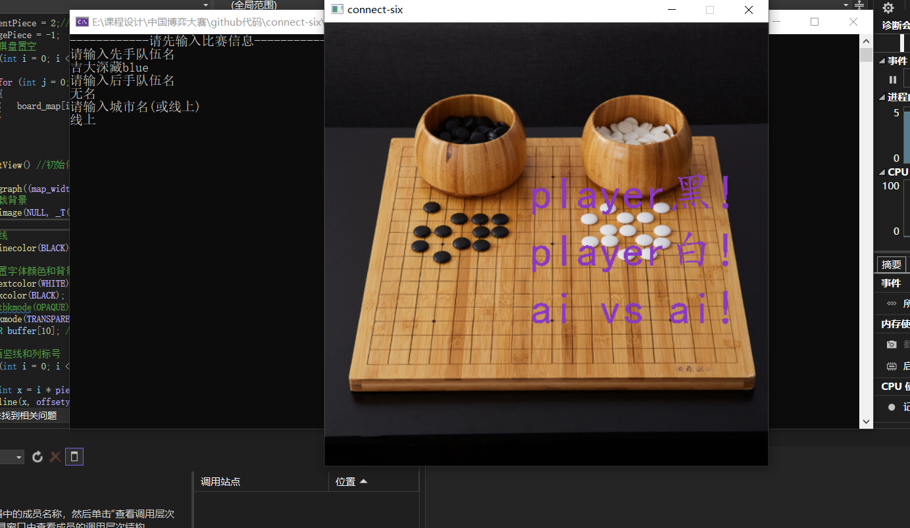
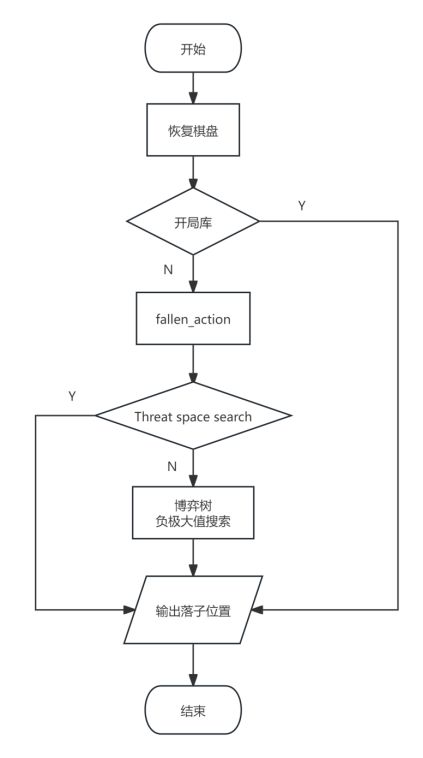
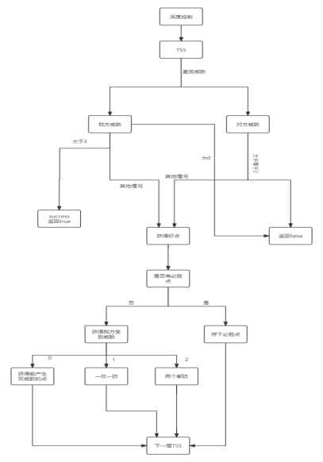
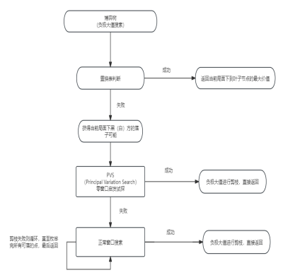

### 一、项目背景

​		近年来，人工智能（AI）在博弈和各棋类领域取得了突破性进展。自 AlphaGo 战胜人类顶级围棋选手以来，基于深度强化学习（Deep Reinforcement Learning）和蒙特卡洛树搜索（Monte Carlo Tree Search, MCTS）等技术的棋类 AI 迅速发展。传统的博弈 AI 依赖搜索和评估函数，而现代 AI 通过神经网络学习棋局策略和价值函数，实现更强大的决策能力。目前，AI 在国际象棋、围棋、五子棋等多个棋类项目中超越了人类顶尖水平，广泛应用于训练辅助、对弈分析及自动对局等场景，推动了棋类竞技和人工智能技术的双向发展。

### 二、项目框架

#### 2.1 总体思路

图1 总体框架
 

​		总体上使用TSS(Threat space search)+alpha-beta搜索（本程序采用负极大值优化，下面将不再区分alpha-beta搜索和负极大值搜索），程序开始首先继承棋盘，若是开局则进入开局库进行开局判断并落子，否则判断TSS是否成功（即是否产生必胜落法），失败则进入alpha-beta搜索（负极大值搜索）。

​		在第一、二回合使用开局库进行落子的选择，作为黑棋，根据现有的棋谱将应对白棋落子位置的一些情况作为开局库的构造函数，存储到hash表中，在程序开始构造开局库实例，在第二回合时到hash表中查找，如果查到对应棋局情况，则由开局库处理，否则转交博弈树搜索，同时使用偏移量大大降低存储的棋局种类数量；作为白棋，同样事先根据黑棋的落子位置存储较优的白棋位置，并且可能多种落子情况随机挑选。

#### 2.2 TSS & Alpha-Beta

图2 TSS逻辑
 

​		在TSS中，主要分为判断威胁数量和获得落子，通过异或树来判断TSS是否成功。

图3 Alpha-Beta逻辑
 

​		在alpha-beta搜索（负极大值搜索）中，首先判断是否存在置换表，若存在则直接利用已有值返回；否则，进入零窗口试探（PVS（Principal Variation Search）），若成功则剪枝返回，否则重新进入正常窗口搜索，不断在博弈树进行搜索，直至满足剪枝返回或者遍历完所有点返回。

### 三、创新之处

### 3.1 开局库使用偏移量降低代码复杂度

​		在第一、二回合使用开局库进行落子的选择，作为黑棋，根据现有的棋谱将应对白棋落子位置的一些情况作为开局库的构造函数，存储到hash表中；作为白棋，同样事先根据黑棋的落子位置存储较优的白棋位置，并且可能多种落子情况随机挑选；无论白棋还是黑棋，对于不同位置的相同棋形，都使用了偏移量大大降低存储的棋局种类数量，从而降低了代码和实现的复杂性。

### 3.2 加快TSS（Threat space search）搜索效率

​		由于经典的alpha-beta搜索中，每层都要搜索大量的点，其中大量的点占用的时间都被浪费，故采用胁迫空间搜索（TSS），只考虑能产生威胁的点，以此缩小备选点的数量，从而提高搜索的层数（本课程设计程序搜索十一层仅耗时0.3s，可至十三层甚至更多），最终判断是否存在必胜的着法。

​		在TSS中，本程序的创新点在于对于不同威胁数量具有不同应对方式，特别是加入一攻一防的策略，在单威胁中不仅仅专注于防守，同时还考虑是否能够进攻进而扭转局势。

​		对于最大提高搜索效率的创新点，我们采用实时更新路的合法性（即当枚举落子时我们更新路的有效性，若一条路中存在不同颜色落子即为无效），从而降低了在TSS中对于需要考虑路的数量，进而大大提高了搜索效率。

​		在外层进入TSS函数过程中，我们借鉴启发式的思想，从小往大枚举层数，若在较小层数即可搜索成功则可大大减少所需时间。

### 3.3 alpha-beta剪枝搜索采用基于路的评估方法+PVS+置换表

​		在alpha-beta剪枝搜索中，需要对当前局面的价值进行评估，获得当前局面的价值，而评估的方式有两种，一种是基于棋型的评估方法，一种是基于路的评估，对于棋型的评估，需要每次遍历整个棋盘，时间复杂度高，因此我们采用基于路的评估方法，每次落子只需更新当前落子位置所在的路，只需要局部更新而不是遍历全局，大大降低时间复杂度，因此在road类中，记录了这条路的信息，方便后续更新、删除等操作。

​		PVS算法是一种变种的alpha-beta剪枝算法，具有更高的搜索效率。在ab搜索中，在不断向子树递归中，先采用PVS进行启发式搜索，在窗口较小时更容易进行ab剪枝，故先采用较小窗口进行搜索，若假设的小窗口剪枝并不影响正确性，则按此结果返回，否则重新进行正常窗口搜索。

​		由于在博弈树搜索过程中，同于同样棋局可能由不同落子顺序获得，故采用置换表，对已经搜索过的的局面所能获得的最大价值记录，在重复进入时若保存的最大价值记录可以进行ab剪枝，则直接返回；其中散列函数使用zobrist，对于棋盘上每个位置的黑棋、白棋、无棋分别初始化一个随机值，其散列值即为所有位置值的异或值之和，同时根据异或的性质，可以实现局部更新，减少了全局更新的额外开销。

### 3.4 alpha-beta剪枝搜索中再进行一次对方TSS

​		为了防止四层博弈树中，因为层数低对某些坏点带来的较优评估的幻觉，我们对在alpha-beta搜索中选出的点，还要进行一次对方的TSS（即我方落点后，对方是否可能在之后若干层内将我必胜），从而为alpha-beta中选择的点加上了一层保险，在保证选择好点的过程中还提高了防守能力。

### 3.5 选点过程中仅选择大于平均评估值的点

​		由于在博弈树或者TSS中的异或树中每层的备选节点很多，通过平均值将部分局部评估小于该平均值的点筛去，从而减少了备选点，提高了搜索效率。